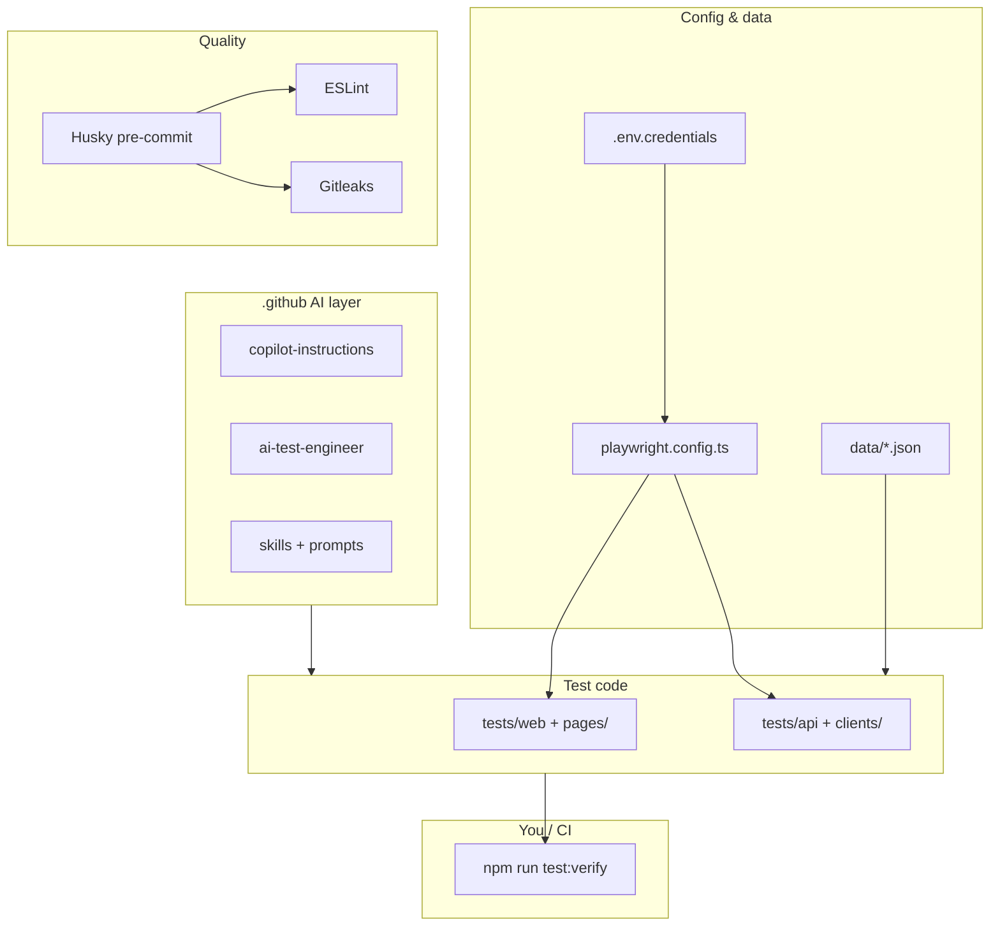

# Playwright + TypeScript AI Agents Template

A modern, scalable, and maintainable end-to-end test automation framework built with **Playwright + TypeScript**, following industry best practices and the Page Object Model (POM) design pattern.

- Web login validation (positive, negative, and edge cases)
- API login validation (positive and negative)
- API user CRUD coverage (`POST`, `GET`, `PUT`, `DELETE`)
- Rich reporting with Playwright HTML + Allure attachments
- MCP + Jira workflow for AI-assisted test case generation

## What was built and why

This repository is a **template for AI-assisted test automation**: runnable Playwright + TypeScript tests (web UI and HTTP API), plus guardrails and prompts so Copilot/Cursor can help without breaking conventions or leaking secrets. The goal is a **repeatable framework** — same patterns for every scenario, same checks before commit, same path from Jira tickets to tests.

### Four layers

| Layer | What was built | Why |
|-------|----------------|-----|
| **1. Foundation** | npm project, `@playwright/test`, TypeScript, `playwright.config.ts`, `tsconfig.json`, ESLint, browsers in `.playwright-browsers/`, `.gitignore` | Reliable, typed automation with reproducible browser versions; generated output and secrets stay out of git. |
| **2. Test framework** | Web POM (`pages/`, `tests/web/`), API clients (`clients/`, `tests/api/`), fixtures/hooks, JSON under `data/`, env via `data/credentials/.env.credentials` | Specs read as scenarios; UI and HTTP details change in one place; public demo apps ([the-internet](https://the-internet.herokuapp.com/login), [DummyJSON](https://dummyjson.com)) let anyone run tests after cloning. |
| **3. Quality & security** | ESLint + Playwright lint rules, Husky pre-commit, Gitleaks, `getRequiredEnv()`, `test:verify` | Catch bad tests and accidental token commits before CI; credentials never hardcoded in source. |
| **4. AI customization** | [`.github/`](.github/README.md) — `copilot-instructions.md`, agent, prompts, skills, guardrails, specifications | AI sessions start with your POM/fixture/security rules instead of generic Playwright snippets. |

### How the layers connect



### Where to read more

| Topic | Section |
|-------|---------|
| Bootstrap commands and `.gitignore` rationale | [Foundation setup — what was done and why](#foundation-setup--what-was-done-and-why) |
| Web/API tests, reporting, MCP + Jira | [What is implemented](#what-is-implemented) |
| Copilot prompts, skills, and guardrails | [`.github/README.md`](.github/README.md) |

---

## Foundation setup — what was done and why

This section records how the repository was bootstrapped and the reasoning behind each choice. Use it as a checklist when reproducing the project on a new machine or explaining the template to a team.

### 1. npm project and core toolchain

| Step | Command / artifact | Why |
|------|-------------------|-----|
| Initialize Node project | `npm init -y` | Creates `package.json` so dependencies, scripts, and lockfile are versioned and reproducible. |
| Install Playwright test runner | `npm install -D @playwright/test` | Official test runner with built-in assertions, fixtures, parallel runs, and browser automation. |
| Install TypeScript | `npm install -D typescript` | Static typing for page objects, API clients, and shared utilities — catches mistakes before runtime. |
| Install Node types | `npm install -D @types/node` | Type definitions for `process`, `path`, and other Node APIs used in config and `utils/env.ts`. |
| Install browsers | `npm run pw:install` (see below) | Playwright ships browser binaries separately from npm packages; they must be downloaded once per environment. |

**Commands used during initial bootstrap:**

```bash
npm init -y
npm install -D @playwright/test typescript @types/node
npm run pw:install
```

On Linux CI or minimal images, OS libraries may also be required:

```bash
npx playwright install-deps
```

### 2. Configuration files

| File | What it does | Why |
|------|--------------|-----|
| `playwright.config.ts` | Test directory, timeouts, reporters, and browser/API projects | Single source of truth for how tests run locally and in CI. Loads credentials via `dotenv` so URLs and secrets stay out of code. |
| `tsconfig.json` | TypeScript compiler options for tests and config | Enables strict checking and IDE autocomplete across `tests/`, `pages/`, `clients/`, and `utils/`. |
| `eslint.config.js` | Lint rules for TS/JS and Playwright tests | Catches common test mistakes (e.g. missing `await`, discouraged patterns) before commit. |
| `.env.example` | Documented template for required variables | Safe to commit; developers copy values into the gitignored credentials file. |
| `.gitignore` | Excludes generated and sensitive paths | Prevents `node_modules`, reports, browser caches, and secrets from entering git history. |

### 3. Local browser install path

Browsers are installed into `.playwright-browsers/` (project-local) via:

```bash
PLAYWRIGHT_BROWSERS_PATH=.playwright-browsers npx playwright install --force chromium firefox
```

**Why:** Pinning browsers inside the repo folder makes installs predictable across machines and CI, avoids clashes with a user-global Playwright cache, and keeps the path explicit in `package.json` (`pw:install`). The directory is gitignored because binaries are large and platform-specific.

### 4. `.gitignore` — what is ignored and why

| Pattern | Why ignore |
|---------|------------|
| `node_modules/` | Restored with `npm install`; never commit dependencies. |
| `/test-results/`, `/playwright-report/`, `/blob-report/` | Generated per run; would bloat the repo and cause merge noise. |
| `.playwright-browsers/`, `.playwright-mcp/` | Downloaded browsers and MCP session output; machine-specific. |
| `allure-results/`, `allure-report/` | Allure output is regenerated from test runs. |
| `data/credentials/.env.credentials` | Holds real usernames, passwords, and API tokens — must not be committed. |
| `.env` | Catch-all for local env overrides. |
| `dist/`, `*.tsbuildinfo` | Build artifacts if TypeScript emit is added later. |
| `.DS_Store`, `.idea/`, most of `.vscode/` | OS/IDE noise; optional `!.vscode/extensions.json` keeps recommended extensions shareable. |

### 5. Dependencies beyond Playwright (and why)

| Package | Role | Why included |
|---------|------|--------------|
| `dotenv` | Loads `data/credentials/.env.credentials` | Keeps secrets and environment-specific URLs out of source code; supports `ENV_FILE` override. |
| `allure-playwright` + `allure-commandline` | Allure reporter and CLI | Step-level reporting, attachments, and history-friendly dashboards beyond Playwright HTML. |
| `eslint`, `@eslint/js`, `typescript-eslint`, `eslint-plugin-playwright`, `globals` | Lint pipeline | Enforces consistent style and Playwright best practices; runs in Husky pre-commit. |
| `husky` | Git hooks | Runs lint and secret scan automatically before each commit. |
| `gitleaks` | Secret scanner | Blocks accidental commit of tokens/passwords detected in staged files. |

### 6. Test architecture layers (built on the foundation)

After bootstrap, the template was extended with a layered layout so web UI, API, and AI-assisted workflows stay separated:

```text
fixtures/   → import test/expect here (web vs API hooks)
hooks/      → beforeEach/afterEach behaviour (screenshots, Allure metadata)
pages/      → UI selectors and actions (POM)
clients/    → HTTP calls and response typing
tests/      → scenarios and assertions only
data/       → JSON fixtures + gitignored credentials
utils/      → env loading, API request/response attachments
```

**Why this split:** Specs stay readable as Given/When/Then-style flows; UI and HTTP details change in one place; fixtures avoid duplicating hook setup; credentials and fixture data stay out of git.

### 7. Quality gates added after bootstrap

| Mechanism | What runs | Why |
|-----------|-----------|-----|
| Husky `.husky/pre-commit` | `npm run lint` then `gitleaks detect` | Fail fast on style issues and leaked secrets before they reach the remote. |
| `npm run test:verify` | Lint + full test suite | CI-friendly single command for merge confidence. |
| `npm run test:verify:full` | Lint + browser reinstall + tests | Use when browsers or Playwright version changed. |

### 8. What you run after cloning

```bash
npm install
npm run prepare          # register Husky hooks (once)
npm run pw:install       # download Chromium + Firefox into .playwright-browsers/
cp .env.example data/credentials/.env.credentials
# edit data/credentials/.env.credentials with real values
npm run test:verify      # lint + run all projects
```

---

## What is implemented

### Web automation (Page Object Model)

- Public test page: `https://the-internet.herokuapp.com/login`
- POM class: `pages/LoginPage.ts`
- Web tests: `tests/web/login.web.spec.ts`
  - Positive login with valid credentials
  - Negative login with invalid password
  - Negative login with invalid username
  - Negative login with empty password
  - Edge login with whitespace username + long password
  - `test.step(...)` for step-level traceability in reports
  - Screenshot attached after each test (last executed step)
  - On failure: failure-point screenshot + failure details attachment
- Shared web hook registration: `hooks/WebHooks.ts` → `fixtures/webTest.ts`

### API automation

- Public API: `https://dummyjson.com`
- Login tests: `tests/api/login.api.spec.ts`
  - Positive login returns tokens
  - Negative login returns proper error
- User CRUD tests: `tests/api/user.crud.api.spec.ts`
  - `POST /users/add`
  - `GET /users/{id}`
  - `PUT /users/{id}`
  - `DELETE /users/{id}`
- Shared API hook registration: `hooks/ApiHooks.ts` → `fixtures/apiTest.ts`

### Reporting

- `playwright-report/`: Playwright HTML report
- `allure-results/`: raw Allure result files
- `allure-report/`: generated Allure report
- API request/response attachments created by `utils/apiReporter.ts`

## Project structure

```text
playwright_typescript_ai_agents_template/
  .husky/
    pre-commit
  data/
    credentials/
      .env.credentials       # gitignored — copy from .env.example
    web/
      login.json
    api/
      login.json
  hooks/
    WebHooks.ts
    ApiHooks.ts
  fixtures/
    webTest.ts
    apiTest.ts
  pages/
    LoginPage.ts
  clients/
    AuthApiClient.ts
    UserApiClient.ts
  tests/
    web/
      login.web.spec.ts
    api/
      login.api.spec.ts
      user.crud.api.spec.ts
  utils/
    apiReporter.ts
    env.ts
  .env.example
  eslint.config.js
  playwright.config.ts
  tsconfig.json
  package.json
  README.md
```

## Prerequisites

| Tool | Minimum version | Verify |
|------|-----------------|--------|
| [Node.js](https://nodejs.org/) | 18.x LTS or newer (20+ recommended) | `node --version` |
| [npm](https://www.npmjs.com/) | Comes with Node.js (9+) | `npm --version` |
| Java Runtime | Required for Allure report generation | `java --version` |

Optional but useful:

- **Git** — version control (`git --version`)
- **VS Code / Cursor** — install the [Playwright Test for VS Code](https://marketplace.visualstudio.com/items?itemName=ms-playwright.playwright) extension

## Setup

For the rationale behind each step, see [Foundation setup — what was done and why](#foundation-setup--what-was-done-and-why).

```bash
# 1. Install dependencies
npm install

# 2. Activate Husky pre-commit hooks (run once after cloning)
npm run prepare

# 3. Install Playwright browser binaries
npm run pw:install

# 4. Create credentials file from example
cp .env.example data/credentials/.env.credentials
# Then fill in your actual credentials
```

## Environment file (`data/credentials/.env.credentials`)

The framework loads environment data from `data/credentials/.env.credentials` by default.
Credentials are **not** hardcoded in test files; tests fail fast if required env values are missing.
This file is gitignored to prevent secret leakage.

Sample values:

```bash
WEB_BASE_URL=https://the-internet.herokuapp.com
WEB_LOGIN_USERNAME=tomsmith
WEB_LOGIN_PASSWORD=SuperSecretPassword!

API_BASE_URL=https://dummyjson.com
API_LOGIN_USERNAME=emilys
API_LOGIN_PASSWORD=emilyspass

# Jira values (for MCP workflow)
JIRA_BASE_URL=https://your-workspace.atlassian.net
JIRA_EMAIL=your-atlassian-email@example.com
JIRA_API_TOKEN=your_generated_api_token
```

To run against a different environment file, use `ENV_FILE`:

```bash
ENV_FILE=data/credentials/.env.staging.credentials npx playwright test
```

Optional API reliability/performance env variables:

```bash
TEST_ENV=local
API_RETRY_ENABLED=true
API_RETRY_MAX_ATTEMPTS=2
API_RETRY_BACKOFF_MS=300
API_MAX_RESPONSE_TIME_MS=4000
```

## Scripts

| Command | Description |
|---------|-------------|
| `npm test` | Run all tests (headless) |
| `npm run test:web` | Run only web tests |
| `npm run test:api` | Run only API tests |
| `npm run test:headed` | Run with visible browser |
| `npm run test:ui` | Open Playwright UI mode |
| `npm run test:debug` | Run in debug mode |
| `npm run test:verify` | Lint + run all tests |
| `npm run test:verify:full` | Lint + reinstall browsers + run all tests |
| `npm run lint` | Run ESLint |
| `npm run lint:fix` | Auto-fix ESLint issues |
| `npm run report:playwright` | Open last Playwright HTML report |
| `npm run report:allure` | Generate and open Allure report |
| `npm run report:allure:refresh` | Clean + regenerate + open Allure report |
| `npm run mcp:playwright` | Start Playwright MCP server |

## Test execution

```bash
# All browsers and projects
npm test

# Web only (Chromium + Firefox)
npm run test:web

# API only
npm run test:api

# Specific browser project
npx playwright test --project=web-chromium
npx playwright test --project=api

# Specific file
npx playwright test tests/web/login.web.spec.ts

# Specific test by name
npx playwright test -g "Positive: user logs in successfully"
```

## Architecture guardrails

- **Fixtures**: Web specs import `test/expect` from `fixtures/webTest`. API specs import from `fixtures/apiTest`.
- **Web automation**: Selectors and UI actions live in `pages/` classes. Specs focus on scenario flow and assertions.
- **API automation**: All API calls route through `clients/` classes. Request/response reporting stays in `utils/apiReporter.ts`.
- **Naming**: `*.spec.ts` for specs, `*Page.ts` for page objects, `*ApiClient.ts` for API clients.
- **Security**: Never hardcode credentials. Keep secrets in `data/credentials/.env.credentials` (gitignored).

## Linting (ESLint)

ESLint is configured with:

- Base JavaScript recommended rules (`@eslint/js`)
- TypeScript recommended rules (`typescript-eslint`)
- Node.js globals (`globals`)
- Playwright lint rules for test files (`eslint-plugin-playwright`)

```bash
npm run lint
npm run lint:fix
```

## Reporting

### Playwright HTML report

```bash
npm run report:playwright
```

### Allure report

Requires Java runtime. If Java was installed with Homebrew:

```bash
export PATH="/opt/homebrew/opt/openjdk/bin:$PATH"
```

```bash
npm run report:allure:generate
npm run report:allure:open
# or
npm run report:allure
# or clean refresh
npm run report:allure:refresh
```

## MCP + Jira workflow (AI-assisted test case generation)

Use Playwright MCP + Jira to derive test cases from tickets:

1. Read ticket summary/description/acceptance criteria.
2. Extract positive, negative, boundary, and risk scenarios.
3. Map each scenario to web or API test coverage.
4. Convert to runnable Playwright TypeScript tests.

### Cursor MCP server configuration

```json
{
  "mcpServers": {
    "playwright": {
      "command": "npx",
      "args": [
        "-y",
        "@playwright/mcp@latest",
        "--browser",
        "chrome",
        "--output-dir",
        ".playwright-mcp",
        "--save-session"
      ],
      "cwd": "/Users/bobeezy/Workspace/TypeScript/playwright_typescript_ai_agents_template"
    }
  }
}
```

### Master prompt template

```text
Use Playwright MCP to open Jira ticket: <JIRA_URL_OR_KEY>.

Context:
- Project path: /Users/bobeezy/Workspace/TypeScript/playwright_typescript_ai_agents_template
- Existing tests to review first: <SPEC_FILES>
- Existing scenarios to exclude: <EXISTING_SCENARIOS_TO_EXCLUDE>

Tasks:
1) Extract requirement and acceptance criteria from the ticket.
2) Return test scenarios in Given/When/Then grouped by:
   - Positive
   - Negative
   - Edge
3) For each scenario include:
   - Priority (P0/P1/P2)
   - Expected result
   - Suggested test name
   - Suggested target file path
4) If requested, implement selected scenarios in TypeScript:
   - Update only approved files
   - Reuse existing test style and helper patterns
   - Keep deterministic data in JSON fixtures under data/
5) After code generation, run lint and targeted tests and report results.
```

## Pre-commit hooks (Husky)

Husky runs automatic checks before every `git commit` to catch issues before they reach the repository.

### What the hook does

The hook at `.husky/pre-commit` runs two checks in sequence:

1. **ESLint** — static analysis to catch TypeScript/JavaScript issues before commit.
2. **Gitleaks** — scans for secrets, tokens, and credentials that should never be committed.

If either check fails, the commit is blocked and the error is shown in the terminal.

### Activate hooks (run once after cloning)

```bash
npm run prepare
```

This registers the `.husky/pre-commit` hook with Git. Without this step, the hook will not fire on `git commit`.

### How to confirm the hook is active

```bash
cat .git/hooks/pre-commit
```

You should see a reference to Husky. If the file is missing or empty, re-run `npm run prepare`.

### Hook behaviour on commit

```
git commit -m "your message"
```

- If lint **passes** and no secrets are found → commit proceeds normally.
- If lint **fails** → commit is blocked; fix the reported ESLint errors then retry.
- If a secret is **detected** → commit is blocked; remove the secret from tracked files, rotate it if needed, then retry.

### Run the checks manually (without committing)

```bash
# Lint only
npm run lint

# Secret scan only
gitleaks detect --source .

# Both together (mirrors what the hook does)
npm run lint && gitleaks detect --source .
```

### Fix lint issues automatically

```bash
npm run lint:fix
```

### Skip the hook (emergency only)

```bash
git commit --no-verify -m "your message"
```

Use `--no-verify` only when absolutely necessary. The CI `test:verify` script acts as a second safety layer.

### Pre-commit hook file

```sh
#!/usr/bin/env sh
npm run lint

#setup Gitleaks secret scanner before commits
gitleaks detect --source .
```

## Secret scanning with Gitleaks

The pre-commit hook runs `gitleaks detect` to prevent committing secrets.

```bash
# Run manually
gitleaks detect --source .

# Recommended before pushing
npm run lint && gitleaks detect --source . && npm test
```

## Learn more

- [Playwright documentation](https://playwright.dev/docs/intro)
- [Writing tests](https://playwright.dev/docs/writing-tests)
- [Test configuration](https://playwright.dev/docs/test-configuration)
- [Allure Playwright](https://allurereport.org/docs/playwright/)
